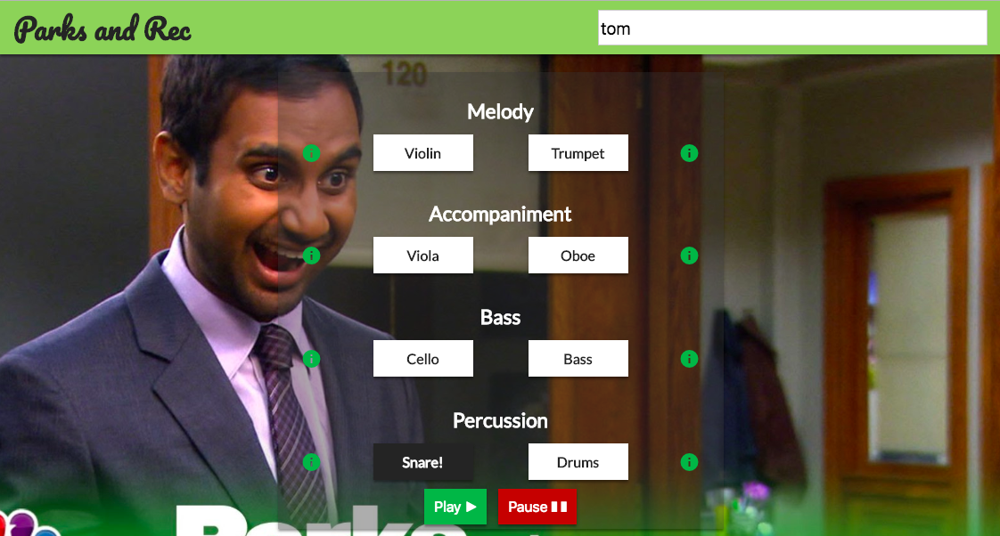
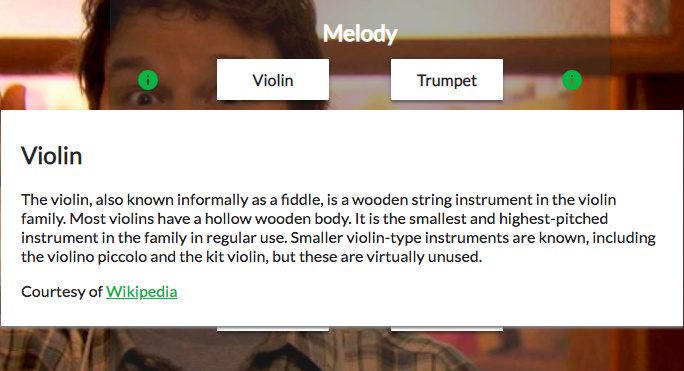

# Parks and Rec
## Vanilla JS Version

[Click here to view the app.](https://clwilkening.github.io/parks-and-rec/ "Link to this app.")

This is a fun example of DOM interaction with Vanilla JS. The user can select which instruments they'd like to hear, then click play. If all instruments are selected, the entire theme song will play.



Click the "info" icon to see a description of the instrument.



An example of code. 
```
const play = () => {
  const select = document.querySelectorAll('.active');
  if (select.length === 0) alert('pick a sound first!');
  select.forEach(sound => {
    const key = sound.getAttribute("data-key");
    const audio = document.querySelector(`audio[data-key="${key}"]`);
    audio.currentTime = 0;
    audio.play();
  });
};
```

Thanks for reading!

*NBC owns the rights to to Parks and Rec. Not me.*